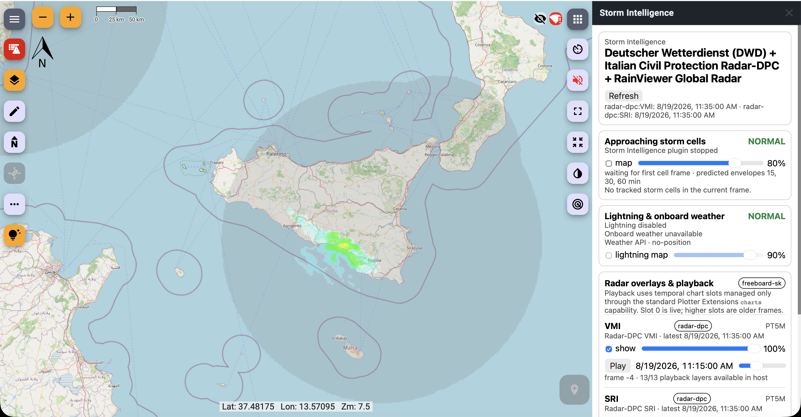

# Freeboard-SK integration

## 1. Role

Freeboard-SK is the principal map presentation target for the reference implementation. The integration is deliberately built on Signal K chart resources and Plotter Extensions rather than DOM/OpenLayers internals so the design remains portable to other conforming plotters.



## 2. Radar mosaics

Enabled raster products are advertised as chart resources with provider/product identity, bounds, zoom limits, attribution and a local Storm Intelligence tile URL.

The local tile endpoint allows provider adaptation, persistence, offline fallback and timestamp selection without exposing upstream credentials or protocol quirks to the plotter.

## 3. Temporal playback

The extension exposes a radar timeline scrubber and animation controls. Current Plotter Extensions APIs can enumerate layers and alter visibility/opacity/order, but they do not retarget one chart source to a new time.

The implementation therefore advertises bounded temporal frame-slot chart resources. Slot 0 is live/current and higher slots are older frames resolved from the actual provider timeline.

Frame slots are a compatibility technique, not the preferred future API. A generic temporal-layer host capability would be cleaner.

## 4. Hazard overlay

Normalized storm geometry is rasterized into transparent PNG chart tiles for current Freeboard compatibility. Rendering includes the recognized cell polygon and bounding box, its evaluated observation-track history, forecast cell paths/envelopes, and—when the vessel path is projected to intersect—a dashed path from `self.navigation.position` to a marked possible-impact point. The impact marker is labelled with its projected UTC date/time and the cell severity.

The vessel projection uses `navigation.speedOverGround` and `navigation.courseOverGroundTrue` when available. An impact is a kinematic path-intersection estimate, not a guaranteed event or a calibrated probability. No impact marker is shown unless the normalized path evaluation reports an intersection.

The normalized vector hazard resource remains the authoritative data representation. Each feature exposes its `bbox` and timestamped `properties.impact` metadata, while the collection records the vessel state used for that evaluation. The raster layer is only a presentation adapter.

## 5. Lightning overlay

Point lightning observations can be rendered as an optional transparent map overlay with age-dependent presentation. Density-capable lightning providers can contribute separate field layers.

Point and density layers remain scientifically distinct even if both are toggled by a common Lightning UI section.

## 6. Host controls

The extension uses standard host methods such as:

```text
chart.list
chart.setVisibility
chart.setOpacity
map.fitBounds
```

Host chart IDs are treated as opaque values. The extension does not reach into Freeboard private state.

## 7. Extension surfaces

The bundled extension contributes a Storm Intelligence panel, toolbar button and compact storm-status widget where supported.

The panel presents radar playback, layer controls, storm cells, lightning and acquisition/degraded status. The standalone companion WebApp remains a separate operational overview.

## 8. Public assets and security

Iframe/static extension assets are served from the public `/plotterext/signalk-storm-intelligence/` route. Weather/radar tiles use narrowly scoped `/stormintelligence/signalk-storm-intelligence/...` routes.

Sensitive configuration and mutation endpoints are not exposed through those asset routes.

## 9. Failure and stale behavior

A plotter should be able to distinguish live from stale/offline playback status. Historical slot selection must remain temporally exact even if live fallback could show another stored frame.

## 10. Future plotter API needs

Implementation experience suggests two generic host capabilities would remove current workarounds:

- temporal chart/layer selection without changing logical chart identity;
- generic vector overlay creation/update/removal for normalized hazards and observations.

Those capabilities should be generic to plotters rather than weather-radar-specific.
